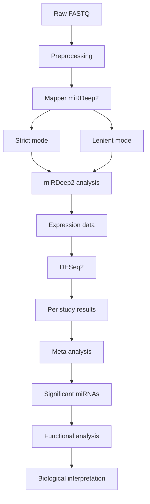

# miRNA-seq Meta-analysis Pipeline (Gastric Cancer)

This repository contains a modular miRNA-seq analysis workflow developed to perform **cross-study meta-analysis of publicly available gastric cancer datasets**.

The pipeline integrates preprocessing, differential expression analysis, meta-analysis, and functional interpretation to identify robust miRNA candidates associated with disease.

---

## 🧠 Project Context

- **Data type:** miRNA-seq (NGS)
- **Organism:** Homo sapiens
- **Use case:** Gastric cancer biomarker discovery
- **Data source:** Public datasets (e.g., GEO / SRA / TCGA-like studies)
- **Environment:** Originally executed on local/HPC systems with absolute paths

> ⚠️ Note: Scripts retain original paths from the working environment. Update paths before running.

---

## 🔬 Pipeline Overview

The workflow is organized into sequential steps:

1. Preprocessing & Mapping  
2. miRNA Quantification (miRDeep2)  
3. Differential Expression Analysis  
4. Meta-analysis across studies  
5. Functional Enrichment Analysis




---

## ⚙️ Step-by-Step Workflow

### 1️⃣ Preprocessing & Mapping

Script: `1_preprocessing_mapper_strict.sh`

- Quality control using **FastQC**
- Adapter trimming using **fastp**
- Read processing using **miRDeep2 mapper.pl**

A second version with relaxed parameters:

Script: `2_mapper_lenient.sh`

---

### 2️⃣ miRNA Quantification

Script: `3_mirdeep2.sh`

- miRNA prediction and quantification using **miRDeep2**
- Generates:
  - expression profiles
  - read mappings
  - result summaries

---

### 3️⃣ Differential Expression Analysis

Script: `4_DESeq2.R`

- Performed separately for each dataset
- Uses **DESeq2**
- Outputs:
  - log2 fold change (LFC)
  - standard error (SE)
  - PCA plots

---

### 4️⃣ Meta-analysis

Script: `6_metafor.R`

- Combines results across datasets using **metafor**
- Method: Random-effects model (REML)

#### Input:
- EffectSize = log2 fold change (LFC)
- SE = standard error from DESeq2

#### Filtering:
- SE > 0 and < 1
- |EffectSize| ≥ 0.5
- miRNAs present in ≥ 2 studies

#### Output:
- Forest plots per miRNA
- Combined meta-analysis results

---

### 5️⃣ Functional Analysis

Script: `5_func_analysis.R`

- Target gene analysis (external tools such as miRDB)
- Gene Ontology enrichment using **clusterProfiler**
- Visualization using **ggplot2**

---

## 🛠 Tools and Packages

### 🔹 Preprocessing
- FastQC  
- fastp  
- miRDeep2  

### 🔹 Statistical Analysis
- DESeq2  
- metafor  

### 🔹 Functional Analysis
- clusterProfiler  
- org.Hs.eg.db  
- ggplot2  

---

## ▶️ How to Use

Example (bash workflow):

```bash
# Step 1: preprocessing
bash 1_preprocessing_mapper_strict.sh

# Step 2: optional lenient mapping
bash 2_mapper_lenient.sh

# Step 3: miRNA quantification
bash 3_mirdeep2.sh
```

Then run R scripts:

#### Differential expression
source("4_DESeq2.R")

#### Meta-analysis
source("6_metafor.R")

#### Functional analysis
source("5_func_analysis.R")

---

## ⚠️ Notes & Limitations

Scripts contain hard-coded paths from the original analysis environment
Data files are not included in this repository
Some steps (e.g., target gene prediction) were performed externally
Workflow is semi-automated and modular, not fully pipeline-managed

---

## 🚀 Future Improvements
Convert full workflow to Nextflow pipeline
Add Docker/Singularity support
Improve parameterization via config files
Automate multi-dataset processing
Standardize input formats (e.g., sample sheets)

---

## 🔗 Related Work

This repository represents the original analysis workflow.
A scalable and reproducible version (Nextflow-based) is planned.

---

## 📌 Summary

This pipeline demonstrates:

- Multi-dataset miRNA-seq processing
- Cross-study meta-analysis
- Integration of statistical and biological interpretation

It reflects real-world bioinformatics analysis performed during research work.
